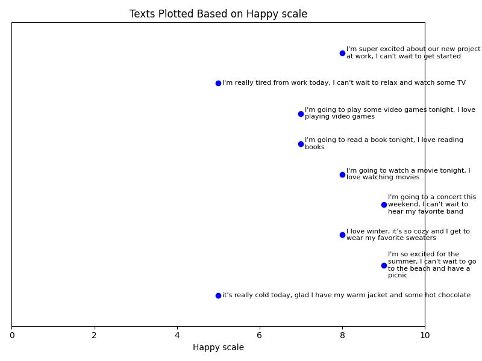
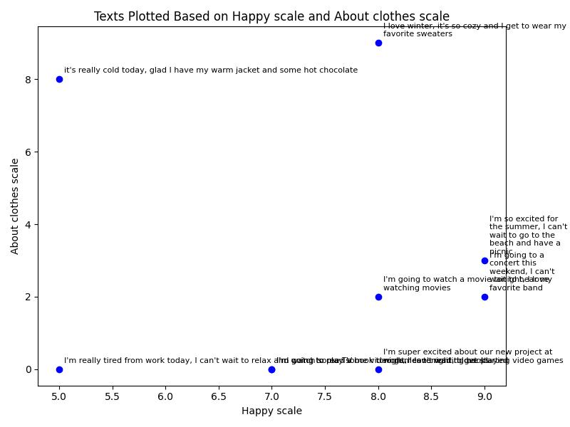

# Text Embeddings and Chart Demo

Using OpenAI's Structured Outputs to generate some low-dimensional Vector Embeddings for a number of phrases. Then, chart those phrases based on one or two of the Vector Embeddings.

Meant to demonstrate the simplicity of Vector Embeddings with easy to understand scales and presenting them on a chart.

*Note*: There are better ways to architect a project, but this is extremely simple and for a demonstration.

## Vector Embeddings - The Simple Explanation

Let me explain Vector Embeddings in the simplest way. So easy your two year old might get it.

On a scale of 1 to 10, how happy are each of these phrases in the screenshot? Congratulations, you just created a one-dimensional Vector Embedding of those phrases. You can plot this on a chart and look for similar amount of happiness. You can find happy phrases or less happy phrases just by looking for closeness to a certain number. That's simple, right?



But, not too helpful. Let's add another ranking something around what the phrases are about. From 1 to 10, how "about clothes" is the phrase? Look at you, you created a two-dimensional Vector Embedding now. You can also chart these so you can visually look for nearby phrases for similarity. This helps you find the happiest ones about clothes! This could also be useful for looking at a bunch of reviews and looking for a relationship between happiness and some feature of the product, like the comfort of it, so see if people like the feel of it or not.



We could go on and on here, adding tons of scales (also called features or dimensions). We can show it in 3d, but depth can be tough to see on a screen. We can add colors, showing green as positive and red as more negative we. Or we could change the sizes of the dots, making higher numbers bigger. That's just six scales. And you can probably do a lot with just six scales.

So, that's what a Vector Embedding is. There are all kinds of uses for it with computers, but they do what you've already done here, help you find similar phrases.

But, you want to know something cool? OpenAI's text-embedding-3-small has 1536 of these scales. Wow! And there are a lot of different ways to determine these scales, different models use different ways. People will try the different versions and see which ones do better for whatever they're doing. Instead of drawing these on a chart, some people store them in a Vector Database, which keeps and finds this data really well. Instead of looking for close ones on a chart, which doesn't really work with more than six scales, they use a math equation to find nearby phrases. One of those equations is called Cosine (pronounced Ko-Sign) Similarity.

## Create Your Own

If you want to use the same method here to create your own, here's how you do it.

### Installation

Make a virtual environment and install the python requirements.

```bash
python 3.10 -m venv my_env
. ./my_env/bin/activate
pip install -r requirements.txt
```

### Get Vector for Phrases

You can create your own rankings. Or, you can use OpenAI's Structured Outputs to generate some for you. That's what the `get_phrase_embeddings.py` does. I have a list of phrases in there that I load into a Prompt that goes to OpenAI.

Open that file, add in your own OpenAI API Credentials and run it:

```bash
python get_phrase_embeddings.py
```

### Chart the Vectors

Take the output of that run and copy into the `make_plot_from_embeddings.py`. I already have some in there you can use as a demo. You can set the scales to use for the charts.

```bash
python make_plot_from_embeddings.py
```

## License

This project is licensed under the MIT License - see the [LICENSE](LICENSE) file for details.

## Contributing

This project is primarily a demonstration and is not actively seeking contributions. However, if you have suggestions or feedback, feel free to open an issue for discussion.

## Acknowledgments

* [OpenAI](https://openai.com) for providing the API used in this project. [Read all about OpenAI's Vector Embeddings](https://openai.com/index/introducing-text-and-code-embeddings/)
* [matplotlib](https://matplotlib.org/) for providing the charting library.
* [PyroPrompts](https://pyroprompts.com) for providing the need and inspiration. See [full blog post on PyroPrompts](https://blog.pyroprompts.com/post/a762f282-vector-embeddings-simplified/).
* The developers of the libraries used in this project.
